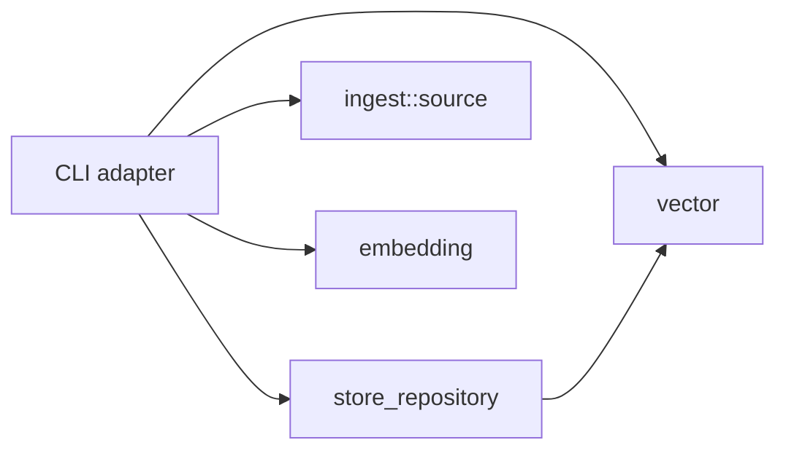

# Architecture

The command-line interface is an outer adapter. Dependencies point inward toward modules that own application data and algorithms.

## Ownership and dependency rules

- `cli` owns argument parsing, command dispatch, orchestration, embedding-provider policy, and JSON presentation.
- `store_repository` owns store-root resolution, store-name validation, persistence paths, JSON persistence, and store lifecycle operations.
- `ingest::source` owns source discovery, ignore handling, supported languages, file reading, chunking, overlap, and line ranges.
- `embedding::local` owns deterministic pseudo-embedding math; the rest of `embedding` owns remote embedding transport.
- `vector` owns vector-store data structures and search behavior.
- The CLI may depend inward on repository, ingest, embedding, and vector modules. Those modules must not depend on the CLI.

Filesystem traversal, persistence details, serialization algorithms, chunking algorithms, and embedding math do **not** belong in the CLI.
