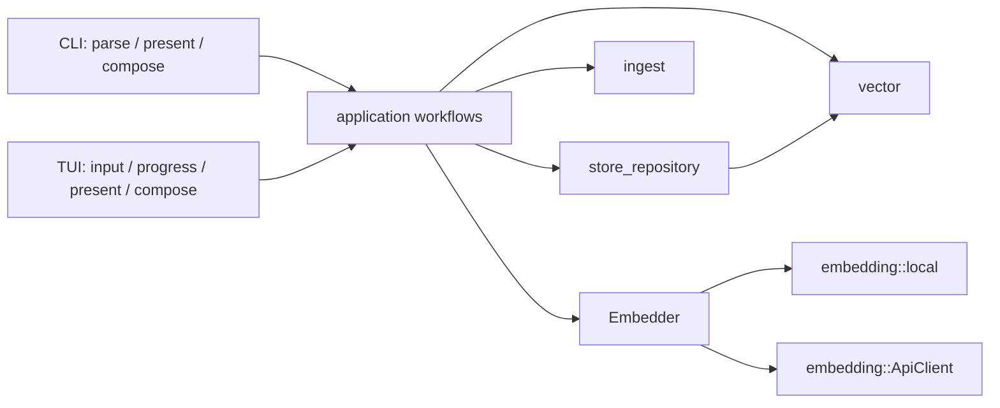

# Architecture

Both UI adapters use a shared, typed in-process application API. Dependencies point inward from
adapters to workflows and from workflows to implementation modules.

## Ownership and dependency rules

- `cli` owns argument parsing, provider composition, and JSON presentation. `app` and `tui` own
  interactive composition, input, progress formatting, logging, and result presentation. Neither
  adapter validates vector dimensions, ingests files, or performs searches directly.
- `application` is the typed workflow boundary. It validates requests and embedding output,
  discovers store dimensions, constructs metadata, coordinates ingest/search, and saves only after a
  complete path-ingest batch succeeds. This prevents partial saves on embedding failures, not
  crash-atomic disk writes or concurrent-writer conflicts.
- `store_repository` owns store-root resolution, store-name validation, persistence paths, JSON
  persistence, and store lifecycle operations.
- `ingest::source` owns source discovery, ignore handling, supported languages, file reading,
  character chunking, overlap, and line ranges. Legacy `Ingest` retains word chunking for the
  ephemeral workflow.
- `Embedder` is an in-process provider abstraction. It accepts the dimensions required by each
  workflow and can report provider-neutral completed/total batch events. Existing provider progress
  channel APIs remain supported. Concrete adapters (`OpenRouterEmbedder`, `PseudoEmbedder`) live in
  `embedding::provider`, not in the workflow implementation.
- `ApplicationEvent` observers are synchronous, optional callbacks. Stages announce work starting;
  the workflow's `Result` indicates success or failure. Frontends own event formatting and channels.
- The CLI's OpenRouter adapter loads configuration lazily on the first actual embedding request.
  Consequently create/list/delete, pseudo embeddings, and explicit-vector add/search do not require
  provider configuration. `ApiClient::with_dimensions` reuses its reqwest client while honoring each
  store's dimensions.
- `vector` owns vector-store data structures, vector validation, and search behavior.

`Application::ingest_and_search` creates its store and metadata entirely in memory. It uses the
actual corpus path as source metadata and never creates repository files.

## Migration status

The CLI and TUI now call `Application` for all workflows. The TUI composes one remote provider and
application instance, bridges neutral `ApplicationEvent` callbacks into its Tokio channel, and uses
`Application::ingest_and_search`. Legacy public embedding progress APIs remain available for
compatibility but are not used by the TUI adapter.
